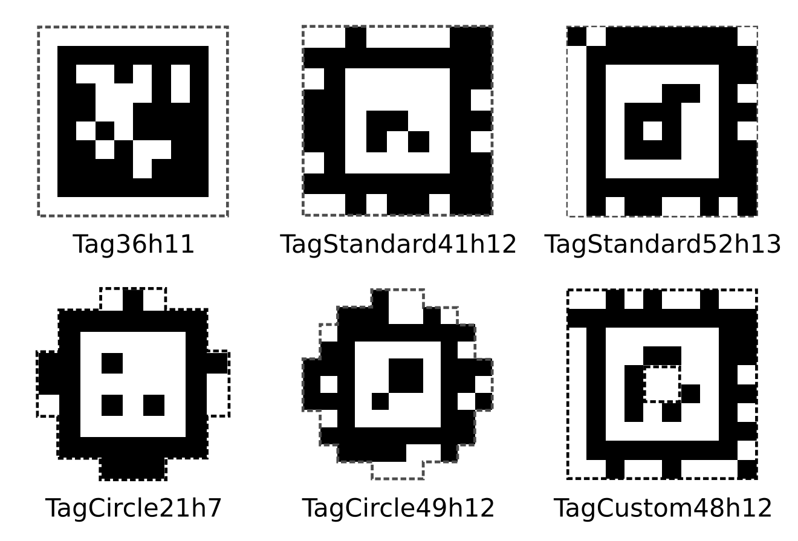

# AprilTag

AprilTag는 시각 마커로 카메라와 마커 간 3차원 상대 위치 및 자세를 쉽게 검출 가능한 기술이다.

## 태그 패밀리



패밀리는 격자 크기와 코드북을 정의한다.
`tag36h11`은 36개 데이터 비트, 유효한 두 코드 사이의 최소 해밍 거리 11을 뜻한다.

| 패밀리 | 격자 크기 | 최소 해밍 거리 | 비고 |
|--------|---------|--------------|-------|
| `tag36h11` | 6×6 | 11 | 권장 기본값. 오검출률이 매우 낮음. |
| `tag25h9` | 5×5 | 9 | ID 수가 더 많지만 오검출이 약간 늘어남. |
| `tag16h5` | 4×4 | 5 | 아주 작고 ID가 많지만 오류에 취약. |
| `tagStandard41h12` | — | 12 | 신규 레이아웃, 강건성 좋음. 새 설계에 권장. |
| `tagCircle21h7`, `tagCustom48h12`, … | — | — | 특수 레이아웃(원형, 고ID 수 등). |

## 공식 AprilTag 저장소 클론

빌드에 공식 저장소 클론이 필요하다. 이 저장소 내에서 다음 명령어를 입력하여 git submodule로 가져온다.

```bash
git submodule update --init --recursive
```

## 테스트

```bash
make test
```

직접 명령어로 테스트하려면

```bash
cmake -S apriltag -B build -DAIDALL_APRILTAG_BUILD_TESTS=ON
cmake --build build && ./build/test_detector
pytest python/tests
```

## 문서

개념 및 사용법에 관해서는 [`docs/`](docs/)의 문서를 참고한다.

- [카메라 캘리브레이션](docs/camera-calibration.md)
- [포즈 추정](docs/pose-estimation.md)
- [C++ 사용법](docs/cpp.md)
- [Python 사용법](docs/python.md)
- [태그 생성과 인쇄](docs/printing.md)

## 라이센스

이 소스코드는 공식 AprilTag 소스를 래핑한 것으로 BSD-2-Clause 라이센스를 재사용한다, 자세한 내용은 [`NOTICE`](./NOTICE)를 참고.
